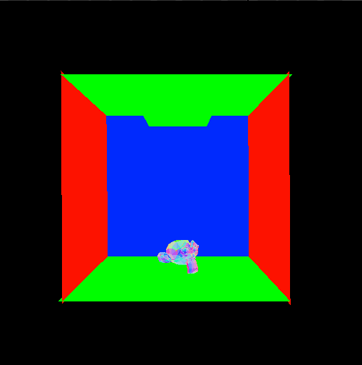

# NanoRT, single header only modern ray tracing kernel.

[](https://travis-ci.org/lighttransport/nanort)



`NanoRT` is simple single header only ray tracing kernel.

`NanoRT` BVH traversal is based on mallie renderer: https://github.com/lighttransport/mallie

## Features

* Portable C++
  * Only use C++-03 features.
* BVH spatial data structure for efficient ray intersection finding.
  * Should be able to handle ~10M triangles scene efficiently with moderate memory consumption
* Triangle mesh only.
  * Facevarying attributes(tex coords, vertex colors, etc)
* Cross platform
  * MacOSX, Linux, Windows, ARM, x86, SPARC, MIPS, etc.
* GPU effient data structure
  * Built BVH tree from `NanoRT` is a linear array and does not have pointers, thus it is suited for GPU raytracing(GPU ray traversal).
* OpenMP multithreaded BVH build.
* Robust intersection calculation.
  * Robust BVH Ray Traversal(using up to 4 ulp version): http://jcgt.org/published/0002/02/02/
  * Watertight Ray/Triangle Intesection: http://jcgt.org/published/0002/01/05/
* Multi-Hit ray traversal.

## Applications

* Test renderer for your light trasport algorithm development.
* Test renderer for your shader language development.
* Collision detection(ray casting).
* BVH builder for GPU/Accelerator ray traversal.
* Add 2D/3D rendering feature for non-GPU system.
  * [ ] ImGui backend? https://github.com/syoyo/imgui/tree/nanort
  * [ ] Nano SVG backend? https://github.com/syoyo/nanovg-nanort

## Projects using NanoRT

* lightmetrica https://github.com/hi2p-perim/lightmetrica-v2

## API

`nanort::Ray` represents ray. The origin `org`, the direction `dir`(not necessarily normalized), the minimum hit distance `minT`(usually 0.0) and the maximum hit distance `maxT`(usually too far, e.g. 1.0e+30) must be filled before shooting ray.
`nanort::Intersection` stores intersection information. 
`nanort::BVHAccel` builds BVH data structure from geometry, and provides the function to find intersection point for a given ray.
`nanort::BVHBuildOptions` specifies parameters for BVH build. Usually default parameters should work well.
`nanort::BVHTraceOptions` specifies ray traverse/intersection options.

```
typedef struct {
  float t;             // [inout] hit distance.
  float u;             // [out] varycentric u of hit triangle.
  float v;	       // [out] varicentric v of hit triangle.
  unsigned int faceID; // [out] face ID of hit triangle.
} Intersection;

typedef struct {
  float org[3];   // [in] must set
  float dir[3];   // [in] must set
  float minT;     // [in] must set
  float maxT;     // [in] must set
  float invDir[3];// filled internally
  int dirSign[3]; // filled internally
} Ray;

class BVHTraceOptions {
  // Trace rays only in face ids range. faceIdsRange[0] < faceIdsRange[1]
  // default: 0 to 0x3FFFFFFF(2G faces)
  unsigned int faceIdsRange[2]; 
  bool cullBackFace; // default: false
};

nanort::BVHBuildOptions options; // BVH build option
nanort::BVHAccel accel;
accel.Build(vertices, faces, numFaces, options);

nanort::Intersection isect;
isect.t = 1.0e+30f;

nanort::Ray ray;
// fill ray org and ray dir.

// Returns nearest hit point(if exists)
BVHTraceOptions traceOptions;
bool hit = accel.Traverse(&isect, mesh.vertices, mesh.faces, ray, traceOptions);

// Multi-hit ray traversal
nanort::StackVector<nanort::Intersection, 128> isects;
int maxIsects = 8;
bool hit = accel.MultiHitTraverse(&isects, maxIsects, mesh.vertices, mesh.faces, ray, traceOptions);
```

Application must prepare geometric information and store it in linear array.

* `vertices` : The array of triangle vertices(xyz * numVertices)
* `faces` : The array of triangle face indices(3 * numFaces)
* uvs, normals, custom vertex attributes : We recommend the application define vertex attributes as facevarying.


## Usage

    // Do this only for *one* .cc file.
    #define NANORT_IMPLEMENTATION
    #include "nanort.h"

    Mesh mesh;
    // load mesh data...

    nanort::BVHBuildOptions options; // Use default option

    printf("  BVH build option:\n");
    printf("    # of leaf primitives: %d\n", options.minLeafPrimitives);
    printf("    SAH binsize         : %d\n", options.binSize);

    nanort::BVHAccel accel;
    ret = accel.Build(mesh.vertices, mesh.faces, mesh.numFaces, options);
    assert(ret);

    nanort::BVHBuildStatistics stats = accel.GetStatistics();

    printf("  BVH statistics:\n");
    printf("    # of leaf   nodes: %d\n", stats.numLeafNodes);
    printf("    # of branch nodes: %d\n", stats.numBranchNodes);
    printf("  Max tree depth   : %d\n", stats.maxTreeDepth);
 
    std::vector<float> rgb(width * height * 3, 0.0f);

    const float tFar = 1.0e+30f;

    // Shoot rays.
    #ifdef _OPENMP
    #pragma omp parallel for
    #endif
    for (int y = 0; y < height; y++) {
      for (int x = 0; x < width; x++) {
        nanort::Intersection isect;

        BVHTraceOptions traceOptions;

        // Simple camera. change eye pos and direction fit to .obj model. 

        nanort::Ray ray;
        ray.minT = 0.0f;
        ray.maxT = tFar;
        ray.org[0] = 0.0f;
        ray.org[1] = 5.0f;
        ray.org[2] = 20.0f;

        float3 dir;
        dir[0] = (x / (float)width) - 0.5f;
        dir[1] = (y / (float)height) - 0.5f;
        dir[2] = -1.0f;
        dir.normalize();
        ray.dir[0] = dir[0];
        ray.dir[1] = dir[1];
        ray.dir[2] = dir[2];

        bool hit = accel.Traverse(&isect, mesh.vertices, mesh.faces, ray, traceOptions);
        if (hit) {
          // Write your shader here.
          float3 normal;
          unsigned int fid = isect.faceID;
          normal[0] = mesh.facevarying_normals[3*3*fid+0]; // @todo { interpolate normal }
          normal[1] = mesh.facevarying_normals[3*3*fid+1];
          normal[2] = mesh.facevarying_normals[3*3*fid+2];
          // Flip Y
          rgb[3 * ((height - y - 1) * width + x) + 0] = fabsf(normal[0]);
          rgb[3 * ((height - y - 1) * width + x) + 1] = fabsf(normal[1]);
          rgb[3 * ((height - y - 1) * width + x) + 2] = fabsf(normal[2]);
        }

      }
    }

## More example

See `example` directory for example renderer using `NanoRT`.

## License

MIT license.

`NanoRT` uses `stack_container.h` which is licensed under:

    // Copyright (c) 2006-2008 The Chromium Authors. All rights reserved.
    // Use of this source code is governed by a BSD-style license that can be
    // found in the LICENSE file.

## TODO

PR are always welcome!

* [ ] Optimize ray tracing kernel
  * [ ] Efficient Ray Tracing Kernels for Modern CPU Architectures http://jcgt.org/published/0004/04/05/
* [ ] Scene graph support.
  * [ ] Instancing support.
* [ ] Optimize Multi-hit ray traversal for BVH.
  * [ ] http://jcgt.org/published/0004/04/04/ 
* [ ] Ray traversal option.
  * [x] FaceID range.
  * [x] Double sided on/off.
  * [ ] Ray offset.
  * [ ] Avoid self-intersection.
  * [ ] Custom intersection filter.
* [ ] Fast BVH build
  * [ ] Bonsai: Rapid Bounding Volume Hierarchy Generation using Mini Trees http://jcgt.org/published/0004/03/02/
* [ ] Support various primitive types
  * [ ] Spheres(particles)
  * [ ] Bezier Curves
  * [ ] Cylinders
