# NanoRT, single header only modern ray tracing kernel.

[](https://travis-ci.org/lighttransport/nanort)
[](https://ci.appveyor.com/project/syoyo/nanort)

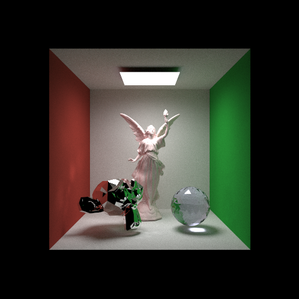

Path tracing example contributed by https://github.com/daseyb

`NanoRT` is simple single header only ray tracing kernel.

## Features

* Portable C++
  * Only use C++-03 features by default.
  * C++11 feature(threads) is also available
  * There is experimental C89 port of NanoRT in `c89` branch https://github.com/lighttransport/nanort/tree/c89
* BVH spatial data structure for efficient ray intersection finding.
  * Should be able to handle ~10M triangles scene efficiently with moderate memory consumption
* Custom geometry & intersection
  * Built-in triangle mesh gemetry & intersector is provided.
* Cross platform
  * MacOSX, Linux, Windows, iOS, Android, ARM, x86, SPARC, (maybe) MIPS, (will be) RISC-V, etc.
  * For example, NanoRT works finely on Raspberry Pi 2 (arm 32bit) and Raspberrry Pi 3!(AARCH64 kernel)
* GPU efficient data structure
  * Built BVH tree from `NanoRT` is a linear array and does not have pointers, thus it is suited for GPU raytracing (GPU ray traversal).
* OpenMP multithreaded BVH build.
* Robust intersection calculation.
  * Robust BVH Ray Traversal (using up to 4 ulp version): http://jcgt.org/published/0002/02/02/
  * Watertight Ray/Triangle Intesection: http://jcgt.org/published/0002/01/05/
* Double precision support
  * Beneficial for HPC and scientific visualization.

## Applications

* Test renderer for your light transport algorithm development.
* Test renderer for your shader language development.
* Collision detection (ray casting).
* BVH builder for GPU/Accelerator ray traversal.
* Add 2D/3D rendering feature for non-GPU system.
  * [ ] ImGui backend? https://github.com/syoyo/imgui/tree/nanort
  * [ ] Nano SVG backend? https://github.com/syoyo/nanovg-nanort

## Projects using NanoRT

* lightmetrica https://github.com/hi2p-perim/lightmetrica-v2
* OSPRay NanoRT module https://github.com/jeffamstutz/module_nanort/
* Your project here!

## Projects similar/related to NanoRT

* bvh: C++17 BVH Construction and Traversal Library https://github.com/madmann91/bvh
* BlazeRT: double precision ray tracer for scientific or engineering applications https://github.com/cstatz/blazert

## API

`nanort::Ray` represents ray. The origin `org`, the direction `dir` (not necessarily normalized), the minimum hit distance `min_t`(usually 0.0) and the maximum hit distance `max_t` (usually too far, e.g. 1.0e+30) must be filled before shooting ray.

`nanort::BVHAccel` builds BVH data structure from geometry, and provides the function to find intersection point for a given ray.

`nanort::BVHBuildOptions` specifies parameters for BVH build. Usually default parameters should work well.

`nanort::BVHTraceOptions` specifies ray traverse/intersection options.

```c
template<typename T>
class {
  T org[3];        // [in] must set
  T dir[3];        // [in] must set
  T min_t;         // [in] must set
  T max_t;         // [in] must set
  unsigned int type;  // optional. ray type.
} Ray;

class BVHTraceOptions {
  // Trace rays only in face ids range. faceIdsRange[0] < faceIdsRange[1]
  // default: 0 to 0x3FFFFFFF(2G faces)
  unsigned int prim_ids_range[2];
  bool cull_back_face; // default: false
};

nanort::BVHBuildOptions<float> build_options; // BVH build option(optional)

const float *vertices = ...;
const unsigned int *faces = ...;

// Need to specify stride bytes for `vertices`.
// When vertex is stored XYZXYZXYZ... in float type, stride become 12(= sizeof(float) * 3).
nanort::TriangleMesh<float> triangle_mesh(vertices, faces, /* stride */sizeof(float) * 3);
nanort::TriangleSAHPred<float> triangle_pred(vertices, faces, /* stride */sizeof(float) * 3);

nanort::BVHAccel<float> accel;
ret = accel.Build(mesh.num_faces, triangle_mesh, triangle_pred, build_options);

nanort::TriangleIntersector<> triangle_intersecter(vertices, faces, /* stride */sizeof(float) * 3);

nanort::Ray<float> ray;
// fill ray org and ray dir.
...
// fill minimum and maximum hit distance.
ray.min_t = 0.0f;
ray.max_t = 1.0e+30f;

nanort::TriangleIntersection<float> isect;

// Store nearest hit point to `isect` and returns true if the hit point found.
BVHTraceOptions trace_options; // optional
bool hit = accel.Traverse(ray, triangle_intersecter, &isect, trace_options);
```

Application must prepare geometric information and store it in linear array.

For a builtin Triangle intersector,

* `vertices` : The array of triangle vertices (e.g. xyz * numVertices)
* `faces` : The array of triangle face indices (3 * numFaces)
* `stride` : Byte stride of each vertex data

are required attributes.


## Usage

```c
// NanoRT defines template based class, so no NANORT_IMPLEMENTATION anymore.
#include "nanort.h"
Mesh mesh;
// load mesh data...
nanort::BVHBuildOptions<float> options; // Use default option
nanort::TriangleMesh<float> triangle_mesh(mesh.vertices, mesh.faces, /* stride */sizeof(float) * 3);
nanort::TriangleSAHPred<float> triangle_pred(mesh.vertices, mesh.faces, /* stride */sizeof(float) * 3);
nanort::BVHAccel<float> accel;
ret = accel.Build(mesh.vertices, mesh.faces, mesh.num_faces, options);
assert(ret);
nanort::BVHBuildStatistics stats = accel.GetStatistics();
printf("  BVH statistics:\n");
printf("    # of leaf   nodes: %d\n", stats.num_leaf_nodes);
printf("    # of branch nodes: %d\n", stats.num_branch_nodes);
printf("  Max tree depth   : %d\n", stats.max_tree_depth);

std::vector<float> rgb(width * height * 3, 0.0f);
const float tFar = 1.0e+30f;
// Shoot rays.
#ifdef _OPENMP
#pragma omp parallel for
#endif
for (int y = 0; y < height; y++) {
  for (int x = 0; x < width; x++) {
    BVHTraceOptions trace_options;
    // Simple camera. change eye pos and direction fit to .obj model.
    nanort::Ray<float> ray;
    ray.min_t = 0.0f;
    ray.max_t = tFar;
    ray.org[0] = 0.0f;
    ray.org[1] = 5.0f;
    ray.org[2] = 20.0f;
    float3 dir;
    dir[0] = (x / (float)width) - 0.5f;
    dir[1] = (y / (float)height) - 0.5f;
    dir[2] = -1.0f;
    dir.normalize();
    ray.dir[0] = dir[0];
    ray.dir[1] = dir[1];
    ray.dir[2] = dir[2];

    nanort::TriangleIntersector<> triangle_intersecter(mesh.vertices, mesh.faces, /* stride */sizeof(float) * 3);
    nanort::TriangleIntersection<> isect,
    bool hit = accel.Traverse(ray, triangle_intersector, &isect, trace_options);
    if (hit) {
      // Write your shader here.
      float3 normal;
      unsigned int fid = triangle_intersector.intersect.prim_id;
      normal[0] = mesh.facevarying_normals[3*3*fid+0]; // @todo { interpolate normal }
      normal[1] = mesh.facevarying_normals[3*3*fid+1];
      normal[2] = mesh.facevarying_normals[3*3*fid+2];
      // Flip Y
      rgb[3 * ((height - y - 1) * width + x) + 0] = fabsf(normal[0]);
      rgb[3 * ((height - y - 1) * width + x) + 1] = fabsf(normal[1]);
      rgb[3 * ((height - y - 1) * width + x) + 2] = fabsf(normal[2]);
    }
  }
}
```

## Defines

```
NANORT_USE_CPP11_FEATURE : Enable C++11 feature
NANORT_ENABLE_PARALLEL_BUILD : Enable parallel BVH build(OpenMP version is not yet fully tested).
```

## More example

See `examples` directory for example renderer using `NanoRT`.

* [x] [examples/path_tracer](examples/path_tracer) Path tracer example by https://github.com/daseyb
  * [x] Better ortho basis generation: Building an Orthonormal Basis, Revisited http://jcgt.org/published/0006/01/01/
* [x] [examples/bidir_path_tracer](examples/bidir_path_tracer) Bi-directional path tracer example by https://github.com/tatsy
* [x] [examples/gui](examples/gui) Simple renderer with GUI(using ImGui)
* [x] [examples/vrcamera](examples/vrcamera) Stereo VR Camera
* [x] [examples/objrender](examples/objrender) Render wavefront .obj model using NanoRT.
* [x] [examples/par_msquare](examples/par_msquare) Render heightfield by converting it to meshes using par_msquare(marching squares)
* [x] [examples/las](examples/las) Visualize LiDAR(LAS) point cloud as sphere geometry.
* [x] [examples/double_precision](examples/double_precision) Double precision triangle geometry and BVH.
* [x] [examples/embree-api](examples/embree-api) NanoRT implementation of Embree API.
* [x] [examples/ptex](examples/ptex) Ptex texturing.

### Screenshots
Raytracing allows to implement different camera models quite easily. See [examples/gui](examples/gui) for different camera
models which can be set via the `config.json` or the GUI itself:
* `perspective`\
  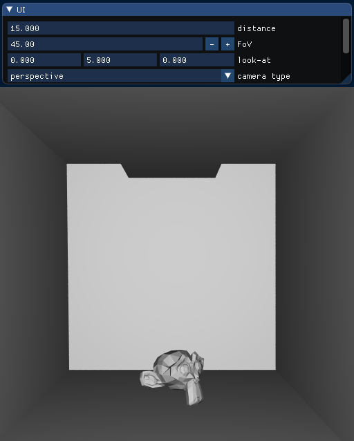
* `orthographic`\
  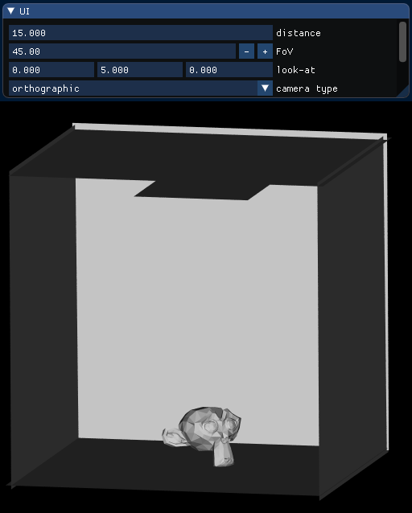
* `spherical` FoV 120 & 180:\
  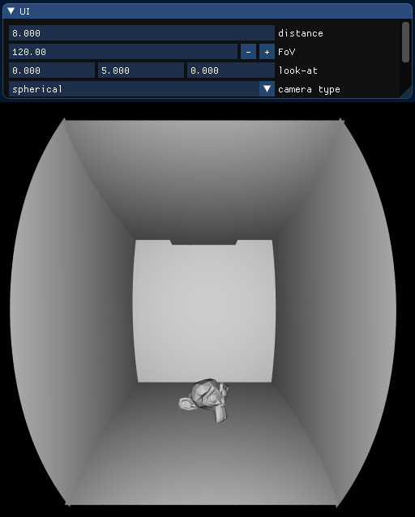
  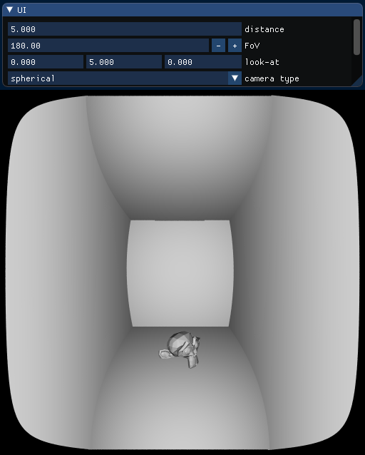
* `spherical-panorama` FoV 120 & 180:\
  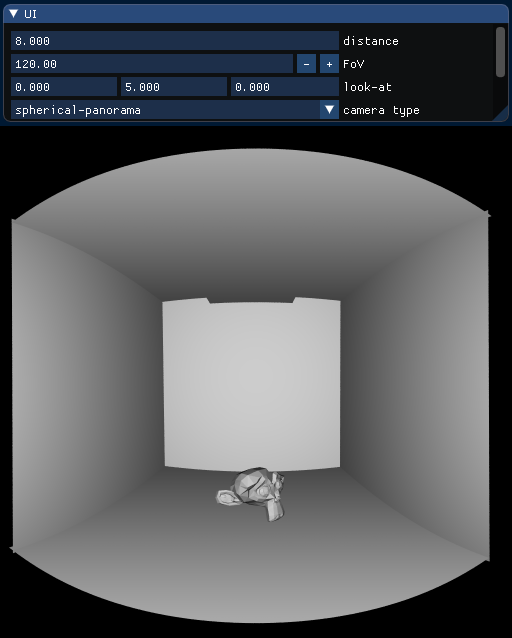
  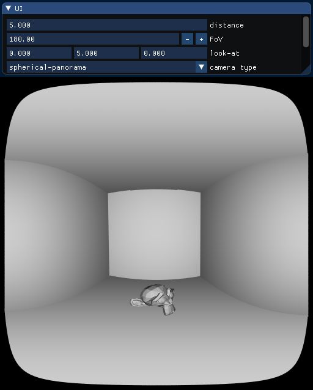
* `cylindrical`: FoV 90 & 120:\
  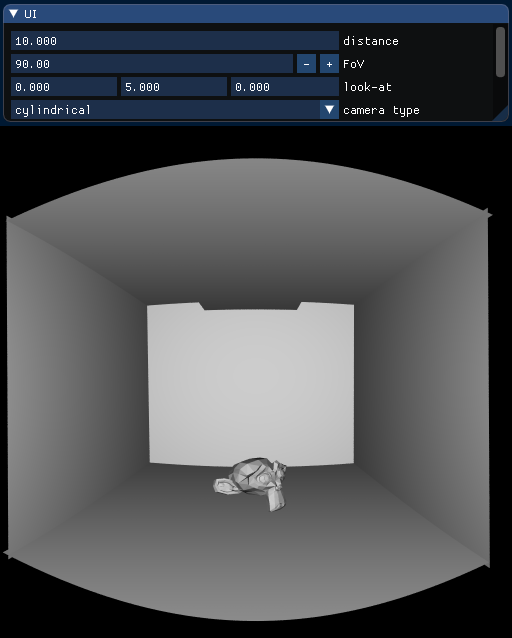
  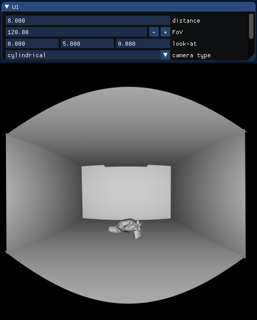
* `fish-eye`: FoV 120 & 180:\
  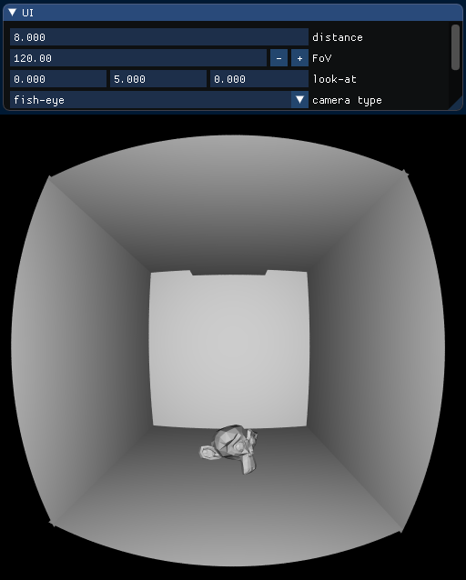
  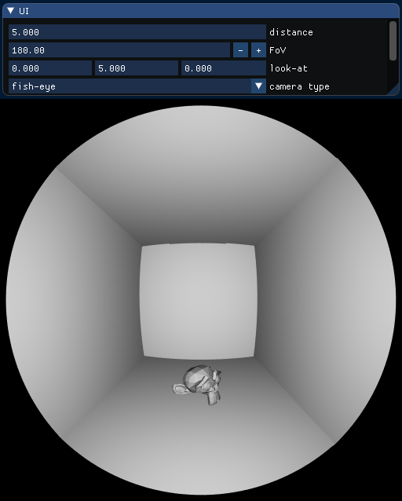
* `fish-eye MKX22`: nonlinear fish-eye lens "iZugar MKX22 Fisheye Lens" with fixed FoV 220:\
  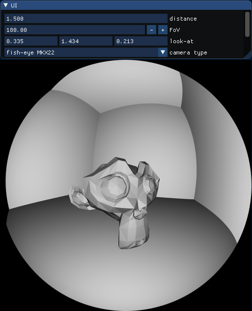

### Custom geometry

Here is an example of custom geometry.

* [x] Spheres(particles) `examples/particle_primitive/`
* Cubic Bezier Curves
  * [x] Approximate as lines `examples/curves_primitive/`
  * [ ] Recursive Ray-Bezier intersection.
* [x] Cylinders `examples/cylinder_primitive/`

And plesae see API at wiki: https://github.com/lighttransport/nanort/wiki/API

## License

`nanort.h` is licensed under MIT license.

`NanoRT` uses `stack_container.h` which is licensed under:

    // Copyright (c) 2006-2008 The Chromium Authors. All rights reserved.
    // Use of this source code is governed by a BSD-style license that can be
    // found in the LICENSE file.

`NanoRT` examples use some external third party libraries. Licenses for such third party libraries obey their own license.

Lucy statue model is from The Stanford 3D Scanning Repository http://graphics.stanford.edu/data/3Dscanrep/

## TODO

PR are always welcome!

* [ ] Optimize ray tracing kernel
  * [ ] Efficient Ray Tracing Kernels for Modern CPU Architectures http://jcgt.org/published/0004/04/05/
  * [ ] ARM NEON SIMD
  * [ ] Intel SSE SIMD
* [ ] Better cmake build.
* [ ] Implement more Embree compatible API.
* [ ] Scene graph support.
  * [x] NanoSG, Minimal scene graph library. [examples/nanosg](examples/nanosg)
  * [ ] Instancing support.
* [ ] Fix multi-hit ray traversal.
* [ ] Optimize Multi-hit ray traversal for BVH.
  * [ ] http://jcgt.org/published/0004/04/04/
* [ ] Ray traversal option.
  * [x] FaceID range.
  * [x] Double sided on/off.
  * [ ] Ray offset.
  * [x] Avoid self-intersection(BVHTraceOptions.skip_prim_id).
  * [x] Custom intersection filter through C++ template.
* [ ] Fast BVH build
  * [ ] Bonsai: Rapid Bounding Volume Hierarchy Generation using Mini Trees http://jcgt.org/published/0004/03/02/
* [ ] Efficient BVH build
  * [ ] Spatial split BVH
* [ ] Motion blur
  * [ ] STBVH: A Spatial-Temporal BVH for Efficient Multi-Segment Motion Blur http://www.highperformancegraphics.org/2017/program/
* [ ] Fast, Accurate ray curve intersection
  * [ ] Phantom Ray-Hair Intersector
* [x] Example bi-directional path tracing renderer by @tatsy.

