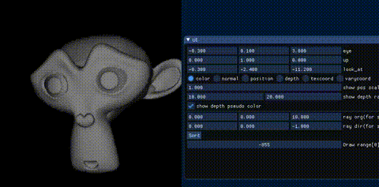

# Polygon face sorting experiment

Sort polygon faces by ray's origin and direction.



## Requirement

* C++11

### Optional requirement

* premake5
* OpenGL(for demo program)

### Build

GUI build

```
$ premake5 gmake
$ make
```

CLI build

```
$ premake5 --file=premake5.cli.lua gmake
$ make
```

## Input

* vertices(floating point value. Assume XYZXYZXYZ...)
* indices(uint32_t)

## Output

* array of index of faces. 0 = backmost, N = frontmost

## Usage

Provide an accesor template class to get polygon's center position.

```
template<typename T>
class TriangleFaceCenterAccessor
{
 public:
  TriangleFaceCenterAccessor(const T *vertices, const uint32_t *indices, const uint32_t num_faces)
    : _vertices(vertices), _indices(indices), _num_faces(num_faces) {
  }

  TriangleFaceCenterAccessor(const TriangleFaceCenterAccessor<T> &rhs) = default;

  std::array<T, 3> operator()(uint32_t idx) const {

    assert(idx < 3 * _num_faces);

    uint32_t i0 = _indices[3 * idx + 0];
    uint32_t i1 = _indices[3 * idx + 1];
    uint32_t i2 = _indices[3 * idx + 2];

    std::array<T, 3> center;

    T p0[3] = {_vertices[3*i0+0], _vertices[3 * i0 + 1], _vertices[3 * i0 + 2]};
    T p1[3] = {_vertices[3*i1+0], _vertices[3 * i1 + 1], _vertices[3 * i1 + 2]};
    T p2[3] = {_vertices[3*i2+0], _vertices[3 * i2 + 1], _vertices[3 * i2 + 2]};

    center[0] = (p0[0] + p1[0] + p2[0]) / static_cast<T>(3.0);
    center[1] = (p0[1] + p1[1] + p2[1]) / static_cast<T>(3.0);
    center[2] = (p0[2] + p1[2] + p2[2]) / static_cast<T>(3.0);

    return center;
  }

 private:
  const T *_vertices;
  const uint32_t *_indices;
  const uint32_t _num_faces;
};
```

### API

Then, feed vertices, indices and Accessor to sorter method.

```
// Sort polygon face by its barycentric z value.
//
// @tparam T Value type for vertex data(float or double)
// @tparam Face accessor
//
// @param[in] num_faces The number of facesRay origin
// @param[in] ray_origin Ray origin
// @param[in] ray_direction Ray direction
// @param[out] sorted_indices Sorted polygon face indices.

template<typename T, class FA>
void SortByBarycentricZ(
  const uint32_t num_faces,
  const float ray_org[3],
  const float ray_dir[3],
  const FA &fa,
  std::vector<uint32_t> *sorted_indices);
```

## Example(Test)

Do simple polygon(3 indices) sorting according to Z .

```
$ cd test/
$ make
$ ./a.out
```

Printed z value should be properly sorted(back to front).

## TODO

* [ ] Advanced sorting(e.g. topologycal sort)
* [ ] Use multi-hit traversal?
  * [ ] Split polygons to solve overlapping problem? https://en.wikipedia.org/wiki/Painter%27s_algorithm
