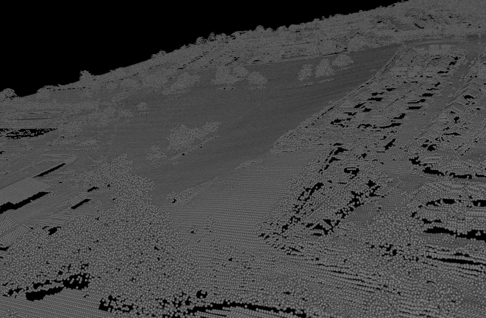

# Simple LAS(LiDAR) particle rendering example with GUI support(bullet3's OpenGLWindow + ImGui).



## Coordinates

Right-handed coorinate, Y up, counter clock-wise normal definition.

## Requirements

* cmake(PDAL) or premake5(liblas)
* OpenGL 2.x
* pdal(Point Data Abstraction layer. recommended) or liblas
* lastools(laszip) (optional)

## TODO

* [x] Color

## Install pdal with conda(recommended)

Supports windows, linux and macOS

```
$ conda create -n nanort-pdal python=3.10
$ conda activate nanort-pdal
$ conda install -c conda-forge nanort-pdal
```

### Build on Windows(Visual Studio 2022)

```
> vcsetup.bat
```

### Build on Linux and macOS

```
$ mkdir build
$ cd build
$ cmake ..
$ make
```

## liblas

liblas support is deprecated, since PDAL is now recommended library to load las.
(And you'll face some Boost problem if you build liblas from source)

Install liblas https://www.liblas.org/

Then,

    $ premake5 gmake
    $ make

### Build on MacOSX

Install liblas using brew

    $ brew install liblas
Then,

    $ premake5 gmake
    $ make

Please note that `libas` installed with brew does not support compreession(LAZ), thus if you want to use laz data, you must first decompress laz using laszip by building http://www.laszip.org/

## Usage

Edit `config.json`, then run `lasrender`

### Mouse operation

* left mouse = rotate
* shift + left mouse = translate
* tab + left mouse = dolly(Z axis)

## Licenses

* glfw : zlib/libpng license.
* picojson : 2-clause BSD license. See picojson.h for more details.
* ImGui : MIT license.
* stb : Public domain. See stb_*.h for more details.

