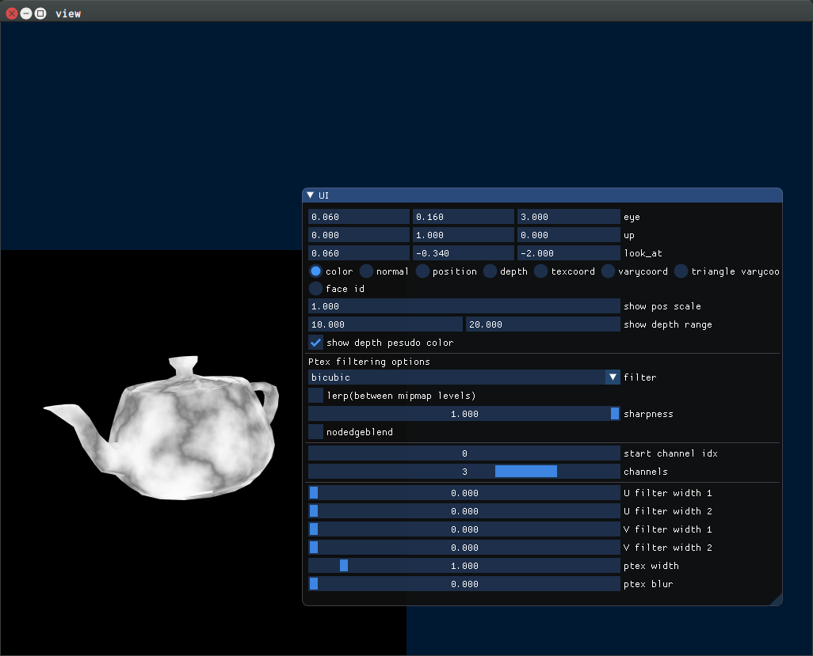

# Simple GUI example with ptex texture mapping.



## Coordinates

Right-handed coorinate, Y up, counter clock-wise normal definition.

## Limitation

Face must be triangle or quad. No n-gons(n >= 5) are supported.

## Requirements

* git
* cmake
* OpenGL 2.x

## Setup

Clone `ptex-aarch64`(Added reading ptex data from memory) https://github.com/syoyo/ptex-aarch64.git to this directory.

```
$ cd $nanort/examples/ptex
$ git clone https://github.com/syoyo/ptex-aarch64.git
```

### cmake build

#### Build on Linux/MacOSX

```
$ rmdir build
$ mkdir build
$ cd build
$ cmake ..
$ make
```

#### Build on Windows

```
$ rmdir /s /q build
$ mkdir build
$ cd build
$ cmake -G "Visual Studio 15 2017" -A x64 ..
```

Open `.sln` and build it with Visual Studio 2017.

## Usage

Prepare ptex scene. for example download some ptex scene for example from http://ptex.us/samples.html

Edit `config.json` and setup file path to .obj and .ptx, then

```
$ cd build
$ ./ptexrt ../config.json
```

## Note on quad primitive

Quad must be planar.

We tessellate a quad to two-triangles and build BVH, then do ray-triangle intersection.
To compute correct UV, we store

## config.json


* `obj_filename` : filepath : filenam of wavefront obj mesh(.obj)
* `ptex_filename` : filepath : filenam of ptex(.ptx)
* `dump_ptex` : true/false : Dump ptex data after loading it.

## TODO

* [ ] Fix varycentric coord calculation in some quad face(e.g. the cap of teapot)
* [ ] Support Quad primitive in ray traversal. http://graphics.cs.kuleuven.be/publications/LD05ERQIT/index.html
  * [ ] Correct barycentric UV calculation for quad primitive.

### Mouse operation

* left mouse = rotate
* shift + left mouse = translate
* tab + left mouse = dolly(Z axis)

