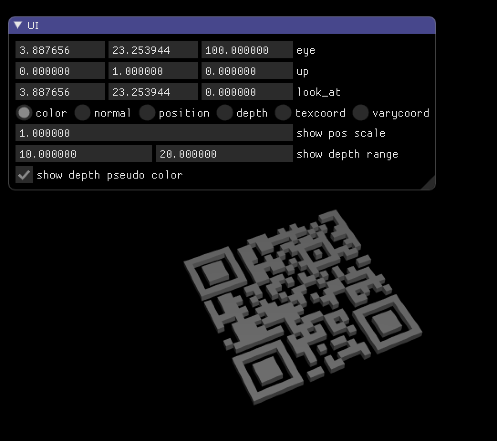

# Simple raytracing of QR code symbol.

Raytrace QR code symbol as cube objects.

## Requirements

* premake5
* OpenGL 2.x

## Build

    $ premake5 gmake
    $ make

## Usage

Edit `config.json`, then

    $ ./bin/native/Release/qrcoderender

### Mouse operation

* left mouse = rotate
* shift + left mouse = translate
* tab + left mouse = dolly(Z axis)

## Licenses

* QR-Code-generator : https://github.com/nayuki/QR-Code-generator See `LICENSE.qrcode` for details

