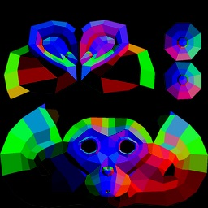
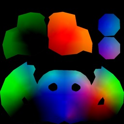

# UV raster using ray casting.




This example rasterize(by ray casting) to generate UV altras image for texture baking, light mapping, etc.

## How it works

Idea is very simple:

* Read 3d mesh
  * Polygons are triangulated. 
* Create 2D mesh by replacing its vertex position with its UV coordinates.
* Build BVH
* Do ray casting
* Save image

This program does not support automatic generation of UV atlas. Input mesh must have UV coordinates for all vertices.

## Requirements

* C++11 compiler
* meson(for ninja and/or msvc build)

## UV images to be generated

Default shader generates following images.

* Vertex position
* Normal vector(in object space)
* Face id(32bit int)
* Barycentric coordinate.

## Build

### Unixish system

```
$ make
```

### MSVC(Visual Studio)

```
$ /path/to/meson.exe builddir --backend vs2017
```

For more details, see meson document.

https://mesonbuild.com/Using-with-Visual-Studio.html

## Usage

Prepare a mesh in wavefront .obj format.
Edit `config.json` if required, then:

```
$ ./uv_raster config.json
```

### configurations

See `config.json` and `Config` class in `main.cc` for details.


## Advantages of using ray casting over polygon rasterizer(e.g. by utilizing OpenGL)

* Can run on CPU(e.g. on the server).
* Can be extendable to non-linear projection(e.g. Envmap, VR camera)
* Can incresae texture resolution for specific region using UDIM feature 
* Can support multi UV channel
* Can add arbitrary AOV channel.

## References

* https://github.com/Thekla/thekla_atlas (customized? version is used in aobaker https://github.com/prideout/aobaker)
  * Use NVMesh for CPU rasterization. The problem of Thekla is they have some restriction on mesh topology.

## TODO

* [ ] Write UV range info as EXR custom attributes.
* [ ] Batch processing and UDIM texture filename support.
* [ ] Integrate UV atlas generator.
* [ ] Support native quad face.
  * Triangulated face may create some shading discontinuities. support quad face natively may improve it(see `ptex` example for ray-quad intersector)
* [ ] Generate texture map layout for patch textures(requires adjacency face calculation)
  * https://graphics.geometrian.com/research/patch-textures.html

